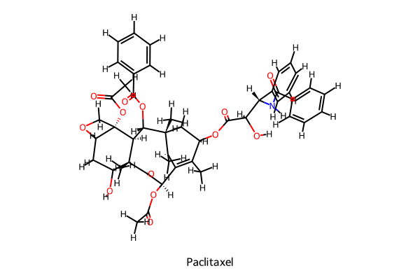
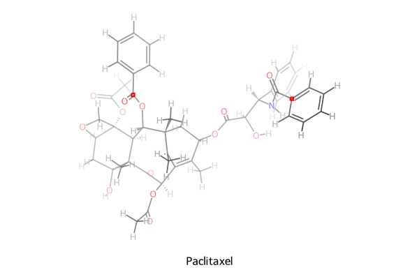
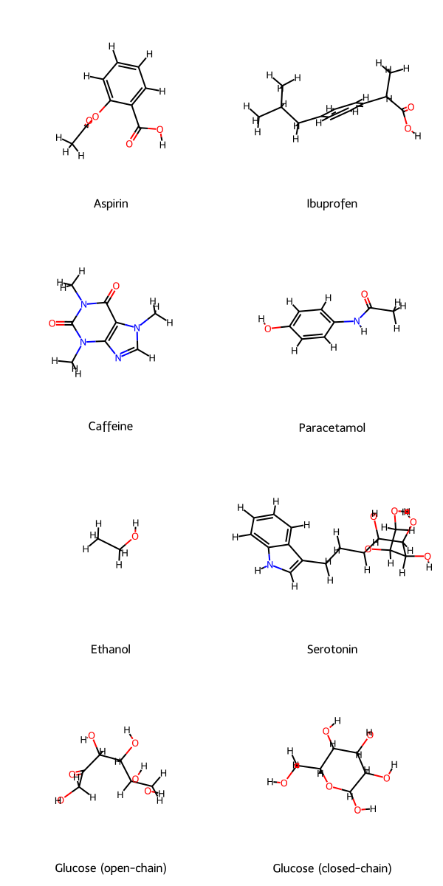
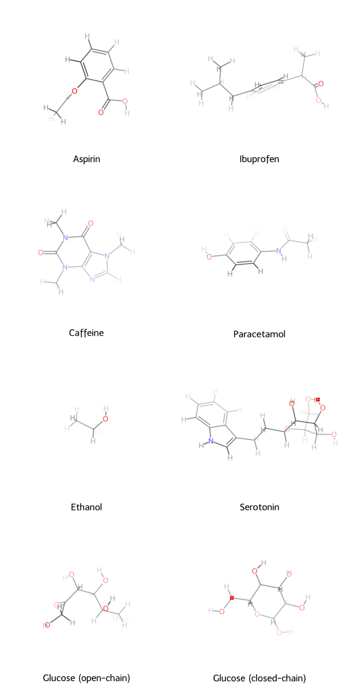
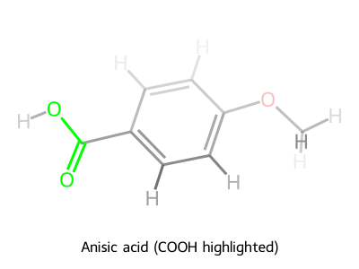
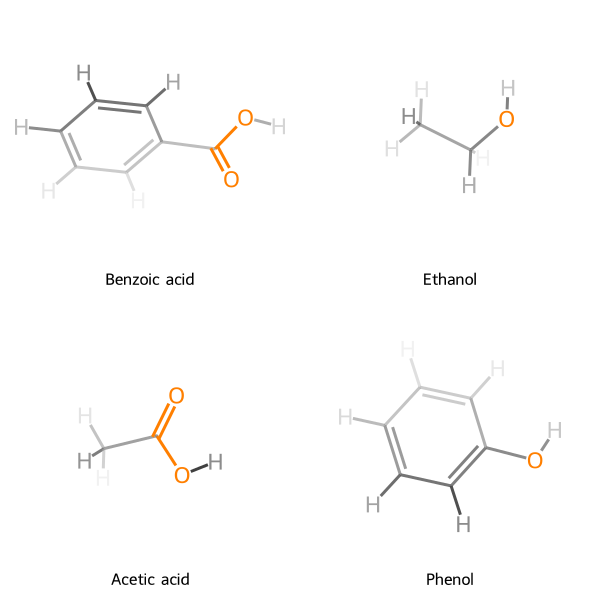

# rdkit-dof

[](LICENSE)
[](https://pypi.org/project/rdkit-dof/)
[](https://pypi.org/project/rdkit-dof/)
[](https://pypi.org/project/rdkit-dof/)
[](https://github.com/gentle1999/rdkit-dof/actions/workflows/build_test_deploy.yml)
[](pyproject.toml)
[](https://docs.astral.sh/ruff/)

[简体中文](README.zh.md)

`rdkit-dof` is a lightweight Python package for rendering RDKit molecules with a depth-of-field (DOF) or fog effect. It uses 3D conformer depth to fade distant atoms and bonds, producing clearer visual depth in 2D molecular depictions.

## Highlights

- Single-molecule and grid rendering with RDKit-compatible APIs.
- SVG and PNG output, including direct file saving.
- Atom and bond highlighting with saturated colors while the rest keeps DOF fading.
- Preset styles: `default`, `nature`, `jacs`, and `dark`.
- Local or global configuration through standard-library dataclasses.
- Optional Jupyter/IPython integration for RDKit `Mol` display.

## Comparison

### Single Molecule

|                        Default RDKit                        |                  rdkit-dof Effect                   |
| :---------------------------------------------------------: | :-------------------------------------------------: |
|  |  |

### Grid Mode

|                    Default RDKit                    |              rdkit-dof Effect               |
| :-------------------------------------------------: | :-----------------------------------------: |
|  |  |

### Highlighting

|                    Single Highlighting                    |                   Grid Highlighting                   |
| :-------------------------------------------------------: | :---------------------------------------------------: |
|  |  |

## Installation

```bash
pip install rdkit-dof
```

## Quick Start

```python
from rdkit import Chem
from rdkit.Chem.rdDistGeom import EmbedMolecule
from rdkit.Chem.rdForceFieldHelpers import MMFFOptimizeMolecule
from rdkit_dof import MolToDofImage, dofconfig

mol = Chem.MolFromSmiles("CCO")
mol = Chem.AddHs(mol)
EmbedMolecule(mol, randomSeed=42)
MMFFOptimizeMolecule(mol)

dofconfig.use_style("nature")

MolToDofImage(
    mol,
    size=(600, 500),
    legend="Ethanol",
    filename="ethanol.svg",
)
```

## Examples

Open the executed notebook for concrete examples with rendered output:

- [Quickstart Notebook](examples/rdkit_dof_quickstart.en.ipynb): single molecule, style presets, highlighting, grid rendering, configuration, notebook integration, and raw SVG/PNG output.
- [中文 Notebook](examples/rdkit_dof_quickstart.zh.ipynb): Chinese version with the same runnable examples.

Molecules with 3D conformers get true depth-based fading. Molecules without conformers are still supported; 2D coordinates are computed automatically and the depth effect is flat.

## Documentation

- [Usage Guide](docs/usage.md): workflow notes for single molecules, grids, highlighting, notebook integration, and custom RDKit drawing.
- [API Reference](docs/api.md): signatures and parameter behavior for `MolToDofImage`, `MolsToGridDofImage`, and `DofDrawSettings`.
- [Configuration](docs/configuration.md): global config, local settings, `.env`, environment variables, and style presets.

## Compatibility

- Python 3.8+
- RDKit 2023.09+
- Linux, macOS, and Windows

Python 3.8 installs are constrained to the last compatible RDKit line (`<2024.3.6`).

## Development

```bash
uv sync --all-extras --dev
uv run pytest
uv run ruff check .
uv run mypy src
uv run pyright
```

To open the notebook examples:

```bash
uv run notebook examples/rdkit_dof_quickstart.en.ipynb
```

To regenerate README showcase images:

```bash
python scripts/_generate_comparison_images.py
```

## License

This project is distributed under the MIT License. See [LICENSE](LICENSE) for details.
