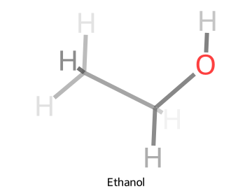

# rdkit-dof

[](LICENSE)
[](https://pypi.org/project/rdkit-dof/)
[](https://pypi.org/project/rdkit-dof/)
[](https://pypi.org/project/rdkit-dof/)
[](https://github.com/gentle1999/rdkit-dof/actions/workflows/build_test_deploy.yml)
[](pyproject.toml)
[](https://docs.astral.sh/ruff/)

[English](README.md)

`rdkit-dof` 是一个轻量级 Python 包，用于为 RDKit 分子图生成景深（Depth of Field, DOF）或雾化效果。它根据 3D 构象中的深度信息淡化远处的原子和键，让 2D 分子图具有更清晰的空间层次。

## 功能亮点

- 支持单分子、分子网格、GIF 动图和 SVG 动画绘制，API 风格接近 RDKit。
- 支持 SVG、PNG、GIF 和 SVG 动画输出，也可直接保存到文件。
- 高亮原子和键使用饱和色，其余部分保留景深淡化效果。
- 内置 `default`、`nature`、`jacs`、`dark` 四种样式。
- 使用标准库 dataclass 配置，支持全局配置和局部配置。
- 可选 Jupyter/IPython 集成，让 RDKit `Mol` 自动以 DOF 风格显示。

## 效果对比

### 单分子

|                       RDKit 默认效果                        |                 rdkit-dof 景深效果                  |
| :---------------------------------------------------------: | :-------------------------------------------------: |
|  |  |

### 网格模式

|                   RDKit 默认效果                    |             rdkit-dof 景深效果              |
| :-------------------------------------------------: | :-----------------------------------------: |
|  |  |

### 高亮

|                        单分子高亮                         |                       网格高亮                        |
| :-------------------------------------------------------: | :---------------------------------------------------: |
|  |  |

### 动画

|                      GIF 动图                       |                      SVG 动画                       |
| :-------------------------------------------------: | :-------------------------------------------------: |
|  |  |

## 安装

```bash
pip install rdkit-dof
```

## 快速开始

```python
from rdkit import Chem
from rdkit.Chem.rdDistGeom import EmbedMolecule
from rdkit.Chem.rdForceFieldHelpers import MMFFOptimizeMolecule
from rdkit_dof import MolToDofImage, MolsToDofGif, MolsToDofSvgAnimation, dofconfig

mol = Chem.MolFromSmiles("CCO")
mol = Chem.AddHs(mol)
EmbedMolecule(mol, randomSeed=42)
MMFFOptimizeMolecule(mol)

dofconfig.use_style("nature")

MolToDofImage(
    mol,
    size=(600, 500),
    legend="Ethanol",
    filename="ethanol.svg",
)

MolsToDofGif([mol, mol], size=(600, 500), duration=250, filename="mols.gif")
MolsToDofSvgAnimation([mol, mol], size=(600, 500), duration=250, filename="mols.svg")
```

不支持 Unicode/非 ASCII legend；`rdkit-dof` 会发出 warning 并原样交给
RDKit。为保证可移植输出，请使用 ASCII legend。

## 示例

具体示例放在已执行的 notebook 中，可以直接看到运行输出：

- [Quickstart Notebook](examples/rdkit_dof_quickstart.zh.ipynb)：单分子、样式预设、高亮、网格绘图、配置、notebook 集成，以及 SVG/PNG 原始输出。
- [English Notebook](examples/rdkit_dof_quickstart.en.ipynb)：包含相同可运行示例的英文版本。

带有 3D 构象的分子会得到真正基于深度的淡化效果。没有构象的分子也可以绘制；包会自动计算 2D 坐标，但景深变化会比较平。

## 文档

- [使用指南](docs/zh/usage.md)：单分子、网格、动图、高亮、notebook 集成和自定义 RDKit 绘制说明。
- [API 参考](docs/zh/api.md)：`MolToDofImage`、`MolsToGridDofImage`、`MolsToDofGif`、`MolsToDofSvgAnimation` 和 `DofDrawSettings` 的参数说明。
- [配置说明](docs/zh/configuration.md)：全局配置、局部配置、`.env`、环境变量和预设样式。

## 兼容性

- Python 3.8+
- RDKit 2023.09+
- Linux、macOS 和 Windows

Python 3.8 安装会限制在最后兼容的 RDKit 版本线 (`<2024.3.6`)。

## 开发

```bash
uv sync --group dev
uv run pytest
uv run ruff check .
uv run mypy src
uv run pyright
```

打开 notebook 示例：

```bash
uv sync --group dev --group notebook
uv run notebook examples/rdkit_dof_quickstart.zh.ipynb
```

重新生成 README 展示图：

```bash
python scripts/_generate_comparison_images.py
```

## 许可证

本项目基于 MIT 许可证发布。详情见 [LICENSE](LICENSE)。
